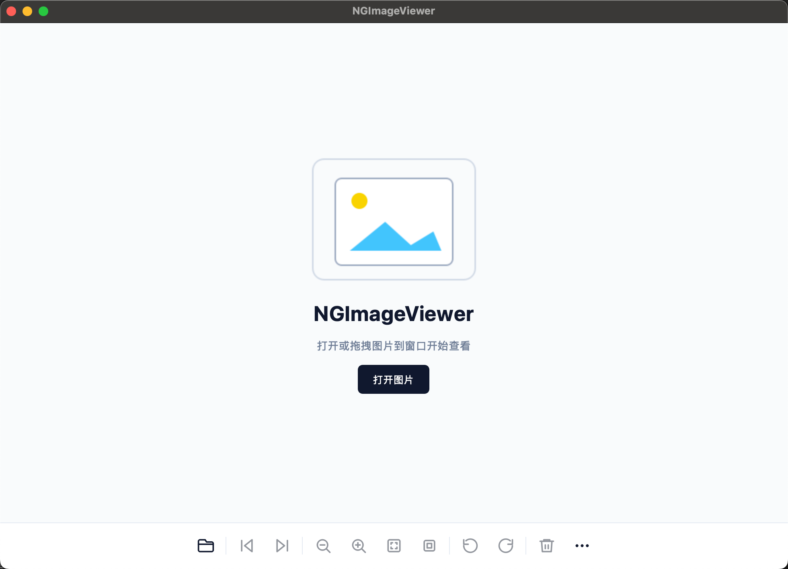

# NgImageViewer

NgImageViewer 是一款基于 Qt 6 的跨平台桌面看图软件，重点关注本地图片浏览、平滑缩放和平移、常用看图快捷操作，以及稳定的 RAW、HEIF/HEIC 格式支持。



## 功能特性

- 支持打开 JPG、PNG、BMP、GIF、WEBP、SVG、HEIF/HEIC 和常见 RAW 格式。
- 支持适配窗口、原始比例显示。
- 支持鼠标滚轮、触摸板手势、`+` / `-` 缩放。
- 支持以鼠标位置为中心缩放，放大后可拖拽平移。
- 支持键盘切换上一张/下一张、方向键平移。
- 支持删除当前图片、复制图片、复制路径、在 Finder 或系统文件管理器中显示。
- 支持缩放状态提示、放大后的概览指示器、更多图片信息面板。
- 通过 bundled LibRaw、libheif、libde265 保证 RAW 和 HEIF/HEIC 在不同系统上的行为尽量一致。

## 基础要求

- CMake 3.19 或更高版本。
- Qt 6.5 或更高版本，包含 `Core`、`Gui`、`Widgets`、`Svg`、`LinguistTools`。
- 支持 C++17 的编译器。
- 初始化 Git submodule。

NgImageViewer 对 RAW 和 HEIF/HEIC 使用工程内置第三方库，不依赖系统安装的 `libraw`、`libheif` 或 `libde265`。

```bash
git submodule update --init --recursive
```

## 构建选项

以下选项默认开启：

```bash
-DNGIMAGEVIEWER_ENABLE_RAW=ON
-DNGIMAGEVIEWER_ENABLE_HEIF=ON
```

如果开启后缺少对应 submodule，CMake 会直接失败，不会回退到系统库。

## macOS 构建

安装 Qt 6 后配置 Release 构建：

```bash
git submodule update --init --recursive
cmake -S . -B build/Qt_6_11_1_for_macOS_Release \
  -DCMAKE_BUILD_TYPE=Release \
  -DCMAKE_PREFIX_PATH=/path/to/Qt/6.x.x/macos
cmake --build build/Qt_6_11_1_for_macOS_Release --target NgImageViewer -j
```

构建产物位于：

```bash
build/Qt_6_11_1_for_macOS_Release/NgImageViewer.app
```

如需打包可分发的 Release app，安装 `dylibbundler` 后执行：

```bash
brew install dylibbundler
scripts/package-macos.sh
```

如需裁剪为单一架构：

```bash
NGIMAGEVIEWER_THIN_ARCH=arm64 scripts/package-macos.sh
```

打包脚本会拒绝处理 Debug app。

## Linux 构建

安装 Qt 6 开发包和构建工具。Debian/Ubuntu 上通常可以使用：

```bash
sudo apt update
sudo apt install build-essential cmake ninja-build pkg-config qt6-base-dev qt6-svg-dev qt6-tools-dev libgl-dev libopengl-dev libegl-dev libglx-dev
```

然后配置并构建：

```bash
git submodule update --init --recursive
cmake -S . -B build -DCMAKE_BUILD_TYPE=Release
cmake --build build -j
```

如果希望生成可分发的 AppDir/AppImage，同时不安装到系统路径，需要先准备 `linuxdeploy` 和 `linuxdeploy-plugin-qt`，然后执行：

```bash
scripts/package-linux.sh
```

该脚本会构建 Release，将应用暂存到 `dist/linux/NgImageViewer.AppDir`，通过 `linuxdeploy` 和 Qt 插件收集运行依赖，检查暂存后的主程序和 Qt `xcb` 平台插件是否仍有缺失库，并默认输出 `dist/linux/NgImageViewer-x86_64.AppImage`。它不会把文件安装到系统路径。

如果工具不在 `PATH` 中，可以显式指定：

```bash
LINUXDEPLOY=/path/to/linuxdeploy-x86_64.AppImage \
LINUXDEPLOY_PLUGIN_QT=/path/to/linuxdeploy-plugin-qt-x86_64.AppImage \
scripts/package-linux.sh
```

脚本也会自动在 `tools/` 和 `~/Downloads` 中查找 `linuxdeploy-x86_64.AppImage`、`linuxdeploy-plugin-qt-x86_64.AppImage` 和 AppImage `runtime-x86_64`。如果构建机无法通过 FUSE 运行 AppImage，脚本会使用 extract-and-run 模式；如果 `linuxdeploy` 无法自动下载 AppImage runtime，可以把 `runtime-x86_64` 放到 `tools/` 或 `~/Downloads`，也可以设置 `APPIMAGE_RUNTIME=/path/to/runtime-x86_64`。

设置 `NGIMAGEVIEWER_LINUX_APPIMAGE=0` 可以只生成 AppDir。`LibRaw`、`libheif`、`libde265` 默认通过工程内 submodule 构建并静态链接；Qt 及其插件会被收集到 AppDir/AppImage 中。

安装二进制、`.desktop` 文件和 hicolor 图标：

```bash
cmake --install build --prefix ~/.local
gtk-update-icon-cache ~/.local/share/icons/hicolor 2>/dev/null || true
update-desktop-database ~/.local/share/applications 2>/dev/null || true
```

如果使用 Qt 官方安装器，而不是系统 Qt 包，需要传入 `CMAKE_PREFIX_PATH`：

```bash
cmake -S . -B build \
  -DCMAKE_BUILD_TYPE=Release \
  -DCMAKE_PREFIX_PATH=/path/to/Qt/6.x.x/gcc_64
```

## Windows 构建

安装与你要使用的编译器匹配的 Qt 6，例如 MSVC 或 MinGW。Qt、CMake 和编译器工具链需要保持一致。

生成可分发的 Windows zip 包，建议在 Developer PowerShell 中执行：

```powershell
git submodule update --init --recursive
powershell -ExecutionPolicy Bypass -File scripts\package-windows.ps1 `
  -QtPrefix C:\Qt\6.x.x\msvc2022_64
```

脚本会构建 Release，将文件安装到 `dist\windows\NgImageViewer`，通过同一个 Qt kit 的 `windeployqt` 收集运行依赖，并默认输出 `dist\windows\NgImageViewer-windows-x64.zip`。如果只需要目录、不生成 zip，可以加 `-NoZip`。

Windows 包默认会做体积优化：复制必要的 MSVC runtime DLL，而不是打入完整的 `vc_redist.x64.exe` 安装器；同时跳过 Qt 软件 OpenGL fallback、系统 D3D compiler 和全量 Qt 翻译文件。如果需要更偏兼容性的较大包，可以按需加这些开关：

```powershell
powershell -ExecutionPolicy Bypass -File scripts\package-windows.ps1 `
  -QtPrefix C:\Qt\6.x.x\msvc2022_64 `
  -IncludeCompilerRuntimeInstaller `
  -IncludeOpenGLSoftwareRenderer `
  -IncludeSystemD3DCompiler `
  -IncludeQtTranslations
```

MSVC 示例，建议在 Developer PowerShell 中执行：

```powershell
git submodule update --init --recursive
cmake -S . -B build -G "Ninja" `
  -DCMAKE_BUILD_TYPE=Release `
  -DCMAKE_PREFIX_PATH=C:\Qt\6.x.x\msvc2022_64
cmake --build build --target NgImageViewer -j
```

MinGW 示例：

```powershell
git submodule update --init --recursive
cmake -S . -B build -G "Ninja" `
  -DCMAKE_BUILD_TYPE=Release `
  -DCMAKE_PREFIX_PATH=C:\Qt\6.x.x\mingw_64
cmake --build build --target NgImageViewer -j
```

构建完成后，使用同一个 Qt kit 中的 `windeployqt` 收集运行依赖：

```powershell
C:\Qt\6.x.x\msvc2022_64\bin\windeployqt.exe build\NgImageViewer.exe
```

Windows 可执行文件会通过 `.rc` 资源文件内置应用图标。

## 开发说明

- RAW 支持通过 bundled LibRaw 实现。
- HEIF/HEIC 支持通过 bundled libheif 和 libde265 实现，不需要 Qt HEIF 图片插件。
- SVG 会按矢量内容渲染，放大不会产生位图模糊。
- 大尺寸位图缩放使用按视口绘制的方式，避免分配完整超大 pixmap。

更多格式相关说明：

- [RAW 支持](docs/raw-support.md)
- [HEIF/HEIC 支持](docs/heif-support.md)
